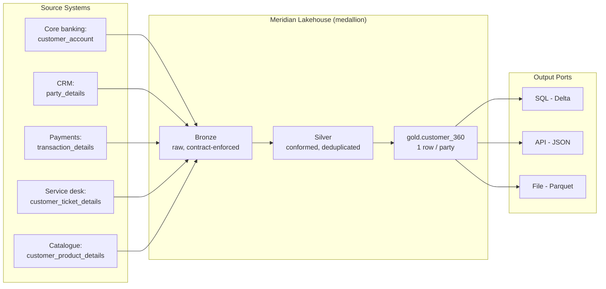

# Customer 360 Data Product — ODPS + ODCS + Agentic Build Demo

A self-contained demo of how a retail-banking **Customer 360** data product is defined, contracted and built in a data-mesh style, agent-driven ecosystem at the fictional **Meridian Retail Bank**.

Three things live here:

1. **Data Product Requirement definition** — [`data-product/customer-360.odps.yaml`](data-product/customer-360.odps.yaml), authored against the **[Open Data Product Specification (ODPS) v4.1](https://opendataproducts.org/v4.1/)**: product strategy & KPIs, identity, SLA and data-quality objectives, output ports, pricing, license and data holder.
2. **Data Contract** — [`data-contract/customer-360.odcs.yaml`](data-contract/customer-360.odcs.yaml), authored against the **[Open Data Contract Standard (ODCS) v3.1.0](https://bitol-io.github.io/open-data-contract-standard/v3.1.0/)** (Bitol / LF AI & Data): full schemas for the five source tables and the `customer_360` output table, PII classifications, FK relationships, quality rules, regulatory SLAs, roles and compliance metadata. The ODPS document links this contract via its `product.contract` object.
3. **Mock agent ecosystem** — [`agents/`](agents/), eight deterministic Python agents plus an orchestrator that take the product from discovery to published-and-governed. See [`agents/README.md`](agents/README.md).

## The banking scenario

Five source tables feed one gold profile table:

| Source table | System of record | Contents |
|---|---|---|
| `customer_account` | Core banking (T24) | Account master: type, status, balance, branch |
| `party_details` | CRM party hub | Party master: identity (PII), KYC status, risk rating, consent |
| `transaction_details` | Payments hub | Posted transactions: amount, channel, merchant category |
| `customer_ticket_details` | Service desk | Complaints & service requests, severity, CSAT |
| `customer_product_details` | Product catalogue | Holdings: loans, cards, deposits, insurance |

**Output:** `gold.customer_360` — exactly one row per resolved party with account/balance aggregates, 90-day transaction behaviour, open-ticket & CSAT summary, product holdings and a churn-risk score. Served through three ports: SQL (Delta/Unity Catalog), REST API (JSON) and file extract (Parquet).

## Architecture



Governance wraps the whole flow: the **ODPS** document states what the product promises, the **ODCS** contract makes it enforceable (schema, quality, SLA, access), and the **audit & compliance agent** verifies PII classification, GDPR lawful basis, BCBS 239 criticality, regulatory retention and approval chains. The **lineage agent** renders the end-to-end source→port graph.

## Running the demo

```bash
pip install -r requirements.txt   # just PyYAML
python orchestrator.py
```

The orchestrator runs all eight agents in order — discovery → requirements → contract → ingestion → transformation → product build → audit & compliance → lineage — printing each agent's report and writing artifacts under `output/` (git-ignored):

```
output/
├── discovery/discovery_report.json        # similar products + duplicate sources found
├── requirements/odps_validation.json      # ODPS validation result
├── contract/odcs_validation.json          # ODCS validation result
├── pipelines/ingestion/ingest_*.json      # 5 bronze pipeline definitions
├── pipelines/transformation/customer_360.sql
├── product/manifest.json                  # published product manifest
├── audit/audit_log.jsonl                  # immutable audit trail
├── audit/compliance_report.json           # 6 compliance checks
└── lineage/lineage.mmd                    # Mermaid end-to-end lineage
```

The discovery step intentionally finds a partially-overlapping existing product ("Customer Analytics Mart", 33% entity overlap) and two uncertified duplicate source tables (`crm_party_master`, `acct_balance_daily`) planted in the mock catalog — demonstrating the *check-before-you-build* governance step.

## Repository layout

```
data-product/customer-360.odps.yaml   # ODPS v4.1 requirement definition
data-contract/customer-360.odcs.yaml  # ODCS v3.1.0 data contract
agents/                               # 8 mock agents + specs + shared models
orchestrator.py                       # end-to-end pipeline runner
output/                               # runtime artifacts (git-ignored)
```

## Standards

| Standard | Version | Scope here |
|---|---|---|
| [ODPS — Open Data Product Specification](https://opendataproducts.org/v4.1/) | 4.1 | The *product*: strategy, KPIs, SLA/DQ objectives, ports, license, holder |
| [ODCS — Open Data Contract Standard](https://bitol-io.github.io/open-data-contract-standard/v3.1.0/) | v3.1.0 | The *contract*: schemas, quality rules, SLAs, roles, compliance metadata |

The two compose: ODPS `product.contract` → ODCS contract `id`, and ODCS `customProperties.odpsProductId` → ODPS `productID`.

> All institutions, systems, people and data in this repository are fictional demo content.
