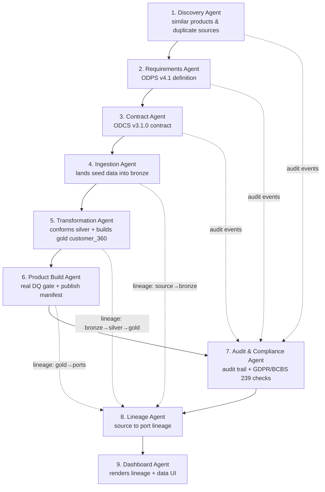

# Customer 360 Agent Ecosystem

Nine mock agents that take the Customer 360 data product from idea to a published, governed, visualized asset. Each agent has a design spec in [`specs/`](specs/) and a runnable, deterministic Python mock in this directory. The mocks are genuinely wired together: every agent emits **audit events** (consumed by the audit & compliance agent), the pipeline agents register **lineage nodes/edges** (rendered by the lineage agent), and they **actually process data** — ~100 correlated records per source table (`data/seed/*.csv`) flow through real bronze → silver → gold execution, not just generated pipeline stubs.

## Agent flow



## Agents

| # | Agent | Module | Spec | Key output |
|---|-------|--------|------|-----------|
| 1 | Discovery | `discovery_agent.py` | [spec](specs/discovery-agent.md) | `output/discovery/discovery_report.json` |
| 2 | Requirements (ODPS) | `requirements_agent.py` | [spec](specs/requirements-agent.md) | `output/requirements/odps_validation.json` |
| 3 | Contract (ODCS) | `contract_agent.py` | [spec](specs/contract-agent.md) | `output/contract/odcs_validation.json` |
| 4 | Ingestion build | `ingestion_agent.py` | [spec](specs/ingestion-agent.md) | `output/bronze/*.json` (500 rows landed) |
| 5 | Transformation build | `transformation_agent.py` | [spec](specs/transformation-agent.md) | `output/silver/*.json`, `output/gold/customer_360.json` (100 rows) |
| 6 | Product build | `product_build_agent.py` | [spec](specs/product-build-agent.md) | `output/product/manifest.json`, `output/product/customer_360.{json,csv}` |
| 7 | Audit & compliance | `audit_compliance_agent.py` | [spec](specs/audit-compliance-agent.md) | `output/audit/compliance_report.json` |
| 8 | Lineage | `lineage_agent.py` | [spec](specs/lineage-agent.md) | `output/lineage/lineage.mmd`, `output/lineage/lineage.json` |
| 9 | Dashboard | `dashboard_agent.py` | [spec](specs/dashboard-agent.md) | `output/dashboard/index.html` |

## Running

Run the whole pipeline (recommended — agents share state through a `PipelineContext`, and later agents read earlier agents' artifacts from `output/`):

```bash
python orchestrator.py        # from the repo root
```

Individual agents can also run standalone with a fresh context, as long as their prerequisite artifacts already exist under `output/`:

```bash
cd agents && python discovery_agent.py
```

Note: `transformation_agent.py` requires `ingestion_agent.py`'s bronze output; `product_build_agent.py` requires ingestion + transformation output; `dashboard_agent.py` requires everything through `lineage_agent.py`. Standalone runs missing a prerequisite report `FAILURE` listing what's absent — that behaviour is itself part of the demo (governance gates), not a bug.

## The data

`data/seed/*.csv` are ~100 fixed, correlated records per source table (see [`scripts/generate_seed_data.py`](../scripts/generate_seed_data.py) for how they were produced — re-run it only if you intend to replace the fixtures; the committed CSVs are the source of truth the agents read). Party, account, transaction, ticket and product-holding records share consistent foreign keys, so the joins in `transformation_agent.py` produce a real, internally-consistent `customer_360` profile per party — open `output/dashboard/index.html` after a pipeline run to see it end to end.

## Design notes

- **Deterministic mocks, real interfaces.** No LLM calls or external services — the demo runs anywhere with Python 3.9+ and PyYAML. Each spec's *Production tools* section describes what the mock stands in for.
- **Contract-driven.** The ingestion and transformation agents derive everything (columns, DQ gates, joins, grain) from the ODCS contract rather than hard-coding — change the contract and the generated pipelines follow.
- **Governance is not optional.** The orchestrator halts on any `FAILURE`, the audit log is append-only, compliance FAILs block publication, and the data-quality gate in `product_build_agent.py` runs against the actual landed/derived data, not a canned result.
