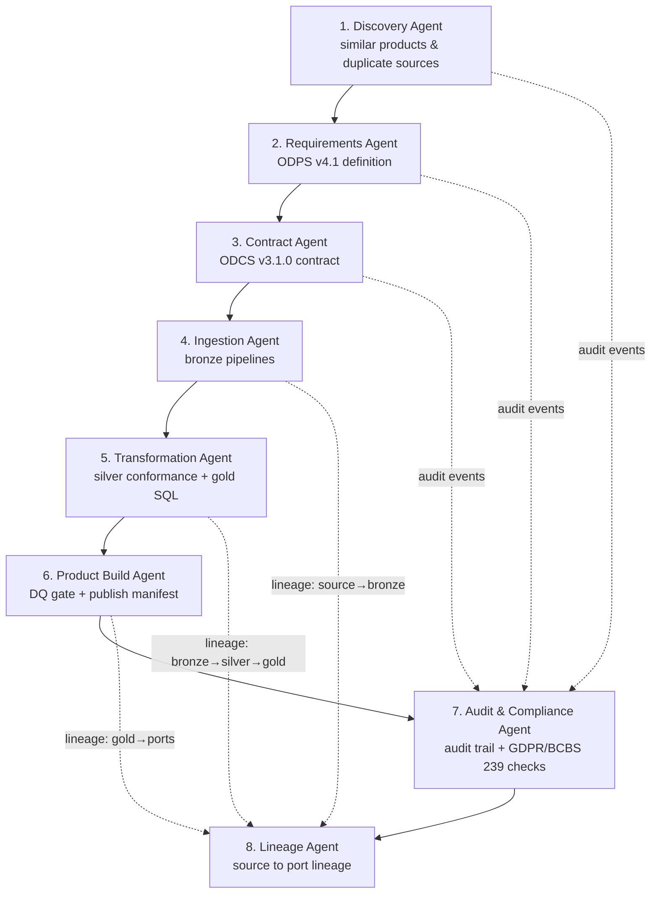

# Customer 360 Agent Ecosystem

Eight mock agents that take the Customer 360 data product from idea to published, governed asset. Each agent has a design spec in [`specs/`](specs/) and a runnable, deterministic Python mock in this directory. The mocks are genuinely wired together: every agent emits **audit events** (consumed by the audit & compliance agent) and the pipeline agents register **lineage nodes/edges** (rendered by the lineage agent).

## Agent flow



## Agents

| # | Agent | Module | Spec | Key output |
|---|-------|--------|------|-----------|
| 1 | Discovery | `discovery_agent.py` | [spec](specs/discovery-agent.md) | `output/discovery/discovery_report.json` |
| 2 | Requirements (ODPS) | `requirements_agent.py` | [spec](specs/requirements-agent.md) | `output/requirements/odps_validation.json` |
| 3 | Contract (ODCS) | `contract_agent.py` | [spec](specs/contract-agent.md) | `output/contract/odcs_validation.json` |
| 4 | Ingestion build | `ingestion_agent.py` | [spec](specs/ingestion-agent.md) | `output/pipelines/ingestion/*.json` |
| 5 | Transformation build | `transformation_agent.py` | [spec](specs/transformation-agent.md) | `output/pipelines/transformation/customer_360.sql` |
| 6 | Product build | `product_build_agent.py` | [spec](specs/product-build-agent.md) | `output/product/manifest.json` |
| 7 | Audit & compliance | `audit_compliance_agent.py` | [spec](specs/audit-compliance-agent.md) | `output/audit/compliance_report.json` |
| 8 | Lineage | `lineage_agent.py` | [spec](specs/lineage-agent.md) | `output/lineage/lineage.mmd` |

## Running

Run the whole pipeline (recommended — agents share state through a `PipelineContext`):

```bash
python orchestrator.py        # from the repo root
```

Individual agents can also run standalone with a fresh context:

```bash
cd agents && python discovery_agent.py
```

Note: `product_build_agent.py` and `lineage_agent.py` depend on artifacts/lineage produced by earlier agents, so standalone runs of those two report the missing prerequisites — that behaviour is itself part of the demo (governance gates).

## Design notes

- **Deterministic mocks, real interfaces.** No LLM calls or external services — the demo runs anywhere with Python 3.9+ and PyYAML. Each spec's *Production tools* section describes what the mock stands in for.
- **Contract-driven.** The ingestion and transformation agents derive everything (columns, DQ gates, joins, grain) from the ODCS contract rather than hard-coding — change the contract and the generated pipelines follow.
- **Governance is not optional.** The orchestrator halts on any `FAILURE`, the audit log is append-only, and compliance FAILs block publication.
